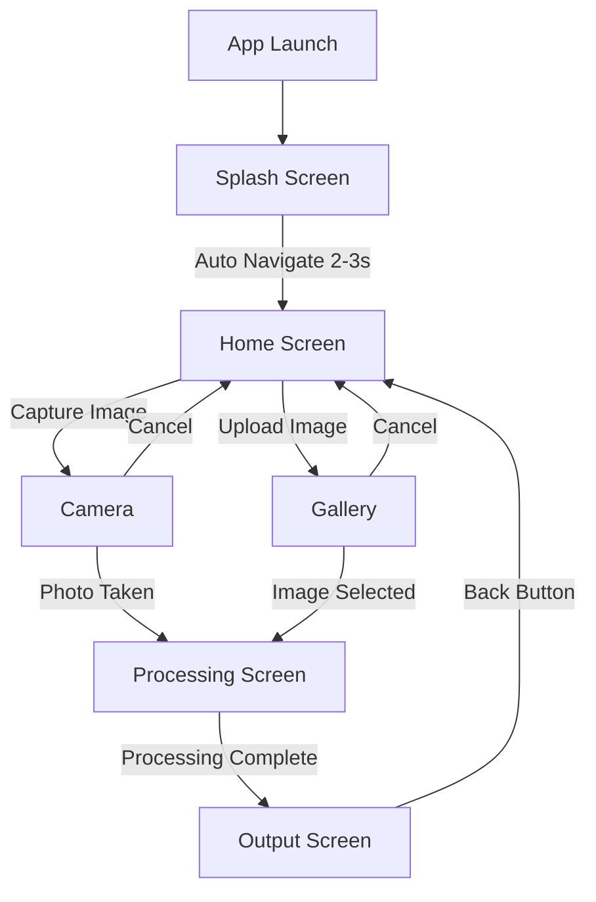

# Design Document

## Overview

WoundWise is a Flutter-based mobile application for intelligent wound assessment. This design document outlines the architecture, components, and implementation strategy for the initial UI phase. The application follows a screen-based navigation pattern with four main screens: Splash, Home, Processing, and Output. The design emphasizes clean architecture principles with clear separation between UI, navigation, and business logic layers.

## Architecture

### High-Level Architecture

The application follows a layered architecture pattern:

```
┌─────────────────────────────────────┐
│         Presentation Layer          │
│  (Screens, Widgets, Theme)          │
├─────────────────────────────────────┤
│         Navigation Layer            │
│  (Routes, Navigation Logic)         │
├─────────────────────────────────────┤
│         Service Layer               │
│  (Image Picker, Camera, Storage)    │
├─────────────────────────────────────┤
│         Platform Layer              │
│  (Flutter Framework, Plugins)       │
└─────────────────────────────────────┘
```

### Navigation Flow



### Folder Structure

```
lib/
├── main.dart                    # App entry point
├── screens/                     # Screen widgets
│   ├── splash_screen.dart
│   ├── home_screen.dart
│   ├── processing_screen.dart
│   └── output_screen.dart
├── widgets/                     # Reusable widgets
│   ├── image_input_button.dart
│   └── loading_indicator.dart
├── theme/                       # Theme configuration
│   ├── app_theme.dart
│   └── app_colors.dart
├── constants/                   # App constants
│   └── app_constants.dart
├── services/                    # Business logic services
│   └── image_service.dart
└── utils/                       # Utility functions
    └── permission_handler.dart
```

## Components and Interfaces

### 1. Main Application Component

**File:** `lib/main.dart`

**Responsibility:** Application initialization and root widget configuration

**Key Elements:**

- MaterialApp configuration
- Theme setup
- Initial route definition
- Named routes registration

### 2. Splash Screen Component

**File:** `lib/screens/splash_screen.dart`

**Responsibility:** Display branded splash screen and auto-navigate to home

**Key Elements:**

- Logo image display (centered)
- Tagline text: "Intelligent Wound Assessment"
- Timer for auto-navigation (2-3 seconds)
- Theme color background

**State:** Stateful widget with timer lifecycle management

### 3. Home Screen Component

**File:** `lib/screens/home_screen.dart`

**Responsibility:** Provide image input options to user

**Key Elements:**

- App bar with title
- Two primary action buttons:
  - Capture Image (camera icon)
  - Upload from Phone (gallery icon)
- Themed button styling
- Navigation to camera/gallery

**State:** Stateless widget (navigation handled by callbacks)

### 4. Processing Screen Component

**File:** `lib/screens/processing_screen.dart`

**Responsibility:** Display loading state during image processing

**Key Elements:**

- Loading indicator (circular progress)
- Status text: "Analyzing wound image..."
- Received image data (stored in state)
- Auto-navigation to output screen after delay

**State:** Stateful widget with processing simulation

**Interface:**

```dart
class ProcessingScreen extends StatefulWidget {
  final File imageFile;

  const ProcessingScreen({required this.imageFile});
}
```

### 5. Output Screen Component

**File:** `lib/screens/output_screen.dart`

**Responsibility:** Display analysis results (currently shows input image)

**Key Elements:**

- Image display area (full width, aspect ratio preserved)
- Placeholder for segmented output (shows original for now)
- "Back to Home" button
- Themed UI elements

**State:** Stateless widget

**Interface:**

```dart
class OutputScreen extends StatelessWidget {
  final File imageFile;

  const OutputScreen({required this.imageFile});
}
```

### 6. Image Service

**File:** `lib/services/image_service.dart`

**Responsibility:** Handle image capture and selection operations

**Key Methods:**

```dart
class ImageService {
  Future<File?> captureImage();
  Future<File?> pickImageFromGallery();
}
```

**Dependencies:**

- `image_picker` package for camera and gallery access

### 7. Theme Configuration

**File:** `lib/theme/app_theme.dart`

**Responsibility:** Define app-wide theme based on logo colors

**Key Elements:**

- Primary color scheme
- Button themes
- Text themes
- AppBar theme

**File:** `lib/theme/app_colors.dart`

**Responsibility:** Define color constants extracted from logo

**Key Elements:**

```dart
class AppColors {
  static const Color primary = Color(0xFF...);
  static const Color secondary = Color(0xFF...);
  static const Color background = Color(0xFF...);
  static const Color text = Color(0xFF...);
}
```

### 8. Reusable Widgets

**File:** `lib/widgets/image_input_button.dart`

**Responsibility:** Styled button for image input actions

**Interface:**

```dart
class ImageInputButton extends StatelessWidget {
  final String label;
  final IconData icon;
  final VoidCallback onPressed;

  const ImageInputButton({
    required this.label,
    required this.icon,
    required this.onPressed,
  });
}
```

**File:** `lib/widgets/loading_indicator.dart`

**Responsibility:** Themed loading indicator with optional message

**Interface:**

```dart
class LoadingIndicator extends StatelessWidget {
  final String? message;

  const LoadingIndicator({this.message});
}
```

## Data Models

### Image Data Flow

The application passes image data between screens using Flutter's navigation arguments:

```dart
// Navigation with image file
Navigator.push(
  context,
  MaterialPageRoute(
    builder: (context) => ProcessingScreen(imageFile: imageFile),
  ),
);
```

### Image File Model

```dart
import 'dart:io';

// Using dart:io File class for image representation
File imageFile;
```

No custom data models are required for this phase as we're working with standard `File` objects from `dart:io`.

## Correctness Properties

_A property is a characteristic or behavior that should hold true across all valid executions of a system-essentially, a formal statement about what the system should do. Properties serve as the bridge between human-readable specifications and machine-verifiable correctness guarantees._

### Property 1: Splash screen auto-navigation timing

_For any_ app launch, the splash screen should navigate to the home screen after a delay between 2 and 3 seconds

**Validates: Requirements 1.3**

### Property 2: Image input navigation consistency

_For any_ successful image capture or upload operation, the system should navigate to the processing screen with a valid non-null image file

**Validates: Requirements 3.3, 4.3**

### Property 3: Permission denial handling

_For any_ permission denial (camera or storage), the system should remain on the home screen and display an appropriate error message without crashing

**Validates: Requirements 3.4, 4.4**

### Property 4: Cancel operation state preservation

_For any_ cancelled image capture or upload operation, the system should return to the home screen without any state changes or navigation to other screens

**Validates: Requirements 3.5, 4.5**

### Property 5: Processing to output navigation

_For any_ image that reaches the processing screen, the system should automatically navigate to the output screen after processing completes

**Validates: Requirements 5.5**

### Property 6: Theme color consistency

_For any_ screen in the application, all UI elements should use colors from the defined theme palette derived from the app logo

**Validates: Requirements 7.1, 7.2, 7.4**

### Property 7: Back navigation from output

_For any_ output screen instance, tapping the back/home button should navigate to the home screen

**Validates: Requirements 6.4, 6.5**

## Error Handling

### Permission Errors

**Camera Permission Denied:**

- Display SnackBar with message: "Camera permission is required to capture images"
- Provide option to open app settings
- Remain on home screen

**Storage Permission Denied:**

- Display SnackBar with message: "Storage permission is required to select images"
- Provide option to open app settings
- Remain on home screen

### Image Selection Errors

**No Image Selected:**

- Return to home screen silently (user cancelled)
- No error message needed

**Invalid Image File:**

- Display SnackBar with message: "Unable to load the selected image"
- Remain on home screen

**Camera Unavailable:**

- Display SnackBar with message: "Camera is not available on this device"
- Remain on home screen

### Navigation Errors

**Missing Image Data:**

- If processing or output screen receives null image, navigate back to home
- Log error for debugging

### General Error Handling Strategy

1. **User-Facing Errors:** Use SnackBar for temporary messages
2. **Critical Errors:** Use AlertDialog for errors requiring acknowledgment
3. **Silent Failures:** Log to console, gracefully degrade functionality
4. **Network Errors:** Not applicable in this phase (no network operations)

## Testing Strategy

### Unit Testing

Unit tests will verify specific functionality and edge cases:

**Theme Tests:**

- Verify theme colors match logo-derived values
- Test theme application to different widget types

**Navigation Tests:**

- Test route definitions and navigation paths
- Verify correct arguments passed between screens

**Service Tests:**

- Test ImageService methods with mocked image_picker
- Verify error handling for permission denials

**Widget Tests:**

- Test ImageInputButton renders correctly with different props
- Test LoadingIndicator displays message when provided

### Property-Based Testing

Property-based tests will verify universal behaviors across many inputs using the `test` package with custom generators:

**Testing Framework:** Dart's built-in `test` package with custom property testing utilities

**Configuration:** Each property test should run a minimum of 100 iterations

**Test Tagging:** Each property-based test must include a comment with format:
`// Feature: wound-wise-ui, Property {number}: {property_text}`

**Property Test Coverage:**

1. **Splash Screen Timing Property** (Property 1)

   - Generate random app launch scenarios
   - Verify navigation occurs within 2-3 second window

2. **Image Navigation Property** (Property 2)

   - Generate various valid image file scenarios
   - Verify navigation to processing screen with non-null file

3. **Permission Denial Property** (Property 3)

   - Generate permission denial scenarios for camera and storage
   - Verify app remains on home screen with error message

4. **Cancel Operation Property** (Property 4)

   - Generate cancel scenarios for both camera and gallery
   - Verify return to home screen without state changes

5. **Processing Navigation Property** (Property 5)

   - Generate various image processing scenarios
   - Verify automatic navigation to output screen

6. **Theme Consistency Property** (Property 6)

   - Generate different screen instances
   - Verify all use theme colors from palette

7. **Back Navigation Property** (Property 7)
   - Generate output screen instances with various images
   - Verify back button navigates to home screen

### Integration Testing

Integration tests will verify end-to-end user flows:

**Test Scenarios:**

1. Complete flow: Launch → Splash → Home → Camera → Processing → Output → Home
2. Complete flow: Launch → Splash → Home → Gallery → Processing → Output → Home
3. Permission denial flow: Home → Camera (denied) → Home with error
4. Cancel flow: Home → Camera → Cancel → Home
5. Theme consistency across all screens

### Widget Testing

Widget tests will verify UI rendering and interactions:

**Test Coverage:**

- Each screen renders without errors
- Buttons respond to tap events
- Images display correctly
- Loading indicators animate
- Text displays correctly
- Theme colors applied correctly

### Testing Dependencies

```yaml
dev_dependencies:
  flutter_test:
    sdk: flutter
  mockito: ^5.4.0 # For mocking services
  integration_test:
    sdk: flutter
```

## Dependencies

### Required Flutter Packages

```yaml
dependencies:
  flutter:
    sdk: flutter
  cupertino_icons: ^1.0.8
  image_picker: ^1.0.0 # Camera and gallery access
  permission_handler: ^11.0.0 # Permission management

dev_dependencies:
  flutter_test:
    sdk: flutter
  flutter_lints: ^6.0.0
  mockito: ^5.4.0
  integration_test:
    sdk: flutter
```

### Asset Configuration

```yaml
flutter:
  uses-material-design: true
  assets:
    - assets/images/logo.png
```

## Implementation Notes

### Phase 1: Core UI (Current Phase)

- Implement all four screens
- Set up navigation
- Configure theme from logo colors
- Implement image capture and upload
- Display original image on output screen

### Phase 2: AI Integration (Future)

- Integrate TensorFlow Lite model
- Implement actual image processing
- Display segmented output
- Add result analysis features

### Performance Considerations

- Use `Image.file()` with caching for efficient image display
- Implement proper disposal of image resources
- Use `const` constructors where possible for widget optimization
- Lazy load screens (default Flutter behavior with named routes)

### Accessibility Considerations

- Provide semantic labels for all interactive elements
- Ensure sufficient color contrast (WCAG AA standard)
- Support screen readers
- Provide alternative text for images

### Platform-Specific Considerations

**Android:**

- Request camera and storage permissions in AndroidManifest.xml
- Handle runtime permissions properly

**iOS:**

- Add camera and photo library usage descriptions in Info.plist
- Handle iOS-specific permission flows

**Both Platforms:**

- Test on different screen sizes
- Handle orientation changes gracefully
- Support both light and dark system themes (future enhancement)
